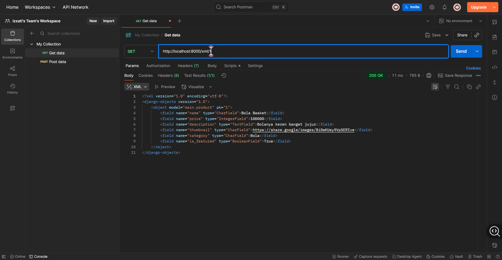
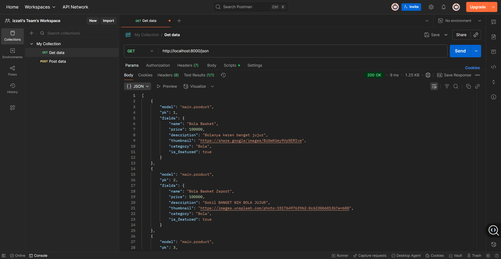
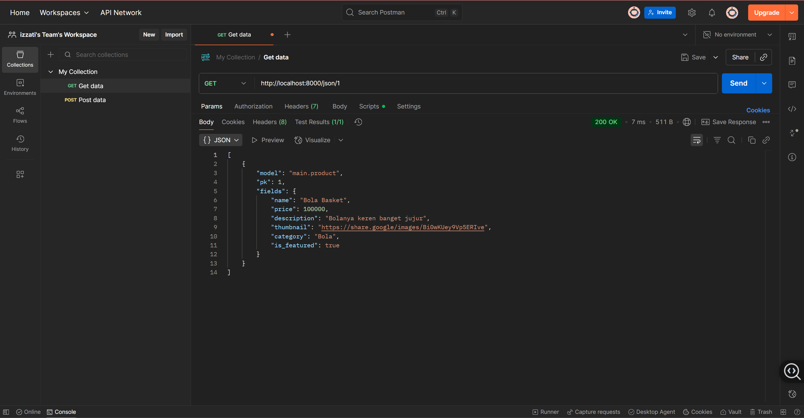

Nama    : Izzati Maharani Yusmananda 
NPM     : 2406361675 
Kelas   : PBP F 
Link    : [ZSPORT](https://izzati-maharani-zsport.pbp.cs.ui.ac.id/)

    
<b>Tugas 2</b>

## Jelaskan bagaimana cara kamu mengimplementasikan checklist di atas secara step-by-step (bukan hanya sekadar mengikuti tutorial).

1. Membuat sebuah proyek Django baru.
Pertama, saya membuat repository dan meng-clone-nya ke terminal VSCode. Kemudian, saya aktifkan virtual environment untuk memastikan data database terisolasi. Setelah itu, saya setup Django dengan menambahkan dependensi di file requirements.txt dan membuat proyek Django baru. Saya juga menambahkan file .gitignore agar file yang tidak perlu tidak

2. Membuat aplikasi dengan nama main pada proyek tersebut.
Setelah setup .gitignore, saya melakukan konfigurasi production pada file .env.prod. Di settings.py, saya mengatur ALLOWED_HOSTS untuk keperluan development dan menyesuaikan database untuk deployment. Selanjutnya, saya membuat aplikasi baru di PWS, mengisi kredensial, dan menyesuaikan environment sesuai dengan .env.prod. Saya juga menambahkan URL deployment di settings.py agar aplikasi bisa diakses dengan URL yang sesuai. Terakhir, saya melakukan add, commit, push, dan memasukkan username dan password SSO sebelum aplikasi dapat diakses.

3. Melakukan routing pada proyek agar dapat menjalankan aplikasi main.
Setelah aplikasi main dibuat, saya melanjutkan dengan melakukan routing di file urls.py pada proyek utama. Saya memastikan agar aplikasi main dapat diakses dengan benar melalui URL tertentu. Saya menambahkan path pada urls.py di proyek utama untuk memetakan ke aplikasi main dan mengarahkan ke fungsi yang ada di views.py yang sudah dibuat sebelumnya.

4. Membuat model pada aplikasi main dengan nama Product dan memiliki atribut wajib
Di langkah berikutnya, saya membuat model baru di aplikasi main dengan nama Product. Model ini memiliki beberapa atribut wajib, seperti name, description, dan price. Saya menentukan tipe data untuk setiap atribut agar sesuai dengan yang dibutuhkan, seperti CharField untuk nama, TextField untuk deskripsi, dan sebagainya. Setelah itu, saya melakukan makemigrations dan migrate untuk menerapkan perubahan ini ke database.

5. Membuat sebuah fungsi pada views.py untuk dikembalikan ke dalam sebuah template HTML yang menampilkan nama aplikasi serta nama dan kelas kamu.
Di views.py, saya membuat sebuah fungsi untuk mengembalikan data yang dibutuhkan ke template HTML. Fungsi ini akan mengambil informasi nama aplikasi, nama saya, dan kelas saya untuk kemudian ditampilkan di halaman HTML. Saya menggunakan render(request, 'template_name.html', context) untuk mengirim data tersebut ke template yang sudah saya buat sebelumnya.

6. Membuat sebuah routing pada urls.py aplikasi main untuk memetakan fungsi yang telah dibuat pada views.py.
Selanjutnya, saya menambahkan route di urls.py milik aplikasi main. Routing ini akan memetakan URL yang diminta pengguna ke fungsi yang sudah dibuat di views.py. Saya menggunakan path() untuk menentukan URL yang sesuai, dan saya pastikan URL tersebut mengarah ke fungsi yang akan menampilkan nama aplikasi serta nama dan kelas saya.

7. Melakukan deployment ke PWS terhadap aplikasi yang sudah dibuat sehingga nantinya dapat diakses oleh teman-temanmu melalui Internet.
Setelah semuanya siap, saya melakukan deploy aplikasi yang sudah saya buat ke PWS. Di sini, saya melakukan push ke GitHub terlebih dahulu, lalu mengikuti proses deployment ke platform PWS. Setelah itu, saya pastikan aplikasi berjalan dengan baik dan dapat diakses melalui URL yang sudah ditentukan, yaitu <username-sso>-<nama proyek>.pbp.cs.ui.ac.id. Kini, aplikasi sudah dapat diakses oleh teman-teman dan siap digunakan.

## Buatlah bagan yang berisi request client ke web aplikasi berbasis Django beserta responnya dan jelaskan pada bagan tersebut kaitan antara 'urls.py', 'views.py', 'models.py', dan berkas html.

Pertama, aplikasi menerima HTTP Request dari pengguna yang berisi permintaan untuk mengakses halaman tertentu. Kemudian, aplikasi akan memeriksa urls.py untuk mencocokkan URL yang diminta dengan pola-pola yang ada di file tersebut. Setelah ditemukan kecocokan, kontrol berpindah ke views.py.

Di views.py, fungsi atau kelas yang sesuai akan menangani permintaan tersebut. Pada tahap ini, aplikasi dapat melakukan berbagai logika, seperti mengambil data dari database melalui models.py atau melakukan perhitungan tertentu. Jika aplikasi memerlukan interaksi dengan database, views.py akan berkomunikasi dengan models.py, yang bertugas untuk mengatur struktur dan operasi terhadap data di database, seperti mengambil atau memperbarui data sesuai dengan permintaan pengguna.

Jika permintaan membutuhkan tampilan HTML, views.py akan merender template yang ada di folder templates. Template ini berisi struktur HTML yang akan dihasilkan dan dipersiapkan untuk dikirimkan ke pengguna.

Setelah semua proses selesai, views.py akan menghasilkan HTTP Response berisi halaman HTML atau data yang diminta. HTTP Response ini kemudian dikirimkan kembali ke pengguna, yang akan melihat hasilnya di browser mereka.

Secara keseluruhan, alur ini memastikan aplikasi Django dapat memproses permintaan pengguna secara tepat, mulai dari menerima HTTP Request, melakukan pemrosesan di views.py, berinteraksi dengan models.py untuk data, merender template HTML, dan akhirnya mengirimkan HTTP Response kembali ke pengguna.

## Jelaskan peran 'settings.py' dalam proyek Django!
Dalam proyek Django, settings.py berfungsi sebagai file konfigurasi utama yang mengatur pengaturan penting agar aplikasi berjalan dengan baik. Di dalamnya, kita bisa mengonfigurasi hal-hal seperti ALLOWED_HOSTS, yaitu daftar host yang diizinkan untuk mengakses aplikasi, yang penting untuk keamanan aplikasi agar hanya host yang valid yang dapat mengirimkan request.

Selain itu, kita juga bisa mengonfigurasi INSTALLED_APPS, yang berisi daftar aplikasi yang aktif dalam proyek. Di sini, kita menentukan aplikasi-aplikasi yang akan digunakan, baik itu aplikasi bawaan Django atau aplikasi yang kita buat sendiri. Dengan begitu, settings.py memastikan aplikasi berjalan sesuai dengan pengaturan yang kita buat, mulai dari pengaturan host hingga aplikasi yang aktif.

## Bagaimana cara kerja migrasi database di Django?
Migrasi database digunakan untuk mengubah struktur database sesuai dengan perubahan yang kita buat di kode, khususnya di file models.py. Misalnya, jika kita menambah atau mengubah kode di model, kita perlu memberitahu Django agar database ikut diperbarui.

Caranya, pertama kita buat perubahan di models.py. Setelah itu, jalankan perintah makemigrations yang akan membuat file berisi instruksi perubahan. Kemudian, dengan perintah migrate, kita melakukan perubahan tersebut ke database seperti mengubah struktur kode yang ada. Jadi, migrasi ini memudahkan kita untuk mengatur perubahan database tanpa harus melakukannya secara manual, hanya dengan mengubah kode di Django.

## Menurut Anda, dari semua framework yang ada, mengapa framework Django dijadikan permulaan pembelajaran pengembangan perangkat lunak?
Menurut saya, Django sering dijadikan pilihan untuk memulai pembelajaran pengembangan perangkat lunak karena telah terbukti stabil dan banyak digunakan oleh perusahaan-perusahaan besar. Selain itu, Django dibangun dengan menggunakan Python, yang sudah saya kuasai sejak awal kuliah, sehingga membuat saya lebih cepat memahami framework ini. Django juga merupakan framework full-stack, yang memungkinkan pengembang untuk membangun backend sekaligus menyediakan fungsionalitas templating untuk frontend, memungkinkan kita untuk membuat tampilan HTML langsung dari aplikasi backend.

Namun, meskipun Django memiliki kemampuan templating untuk frontend, sebenarnya Django lebih berfokus sebagai framework backend. Dengan kata lain, Django menyediakan cara untuk menghasilkan tampilan HTML, namun bukan framework frontend murni seperti React atau Vue. Jadi, Django lebih cocok dipelajari sebagai langkah pertama untuk memahami bagaimana sisi backend bekerja sambil memberikan gambaran tentang bagaimana data disajikan kepada pengguna.

## Apakah ada feedback untuk asisten dosen tutorial 1 yang telah kamu kerjakan sebelumnya?
Tidak ada, karena menurut saya tutorial 1 sudah cukup jelas.

    
<b>Tugas 3</b>

##  Jelaskan mengapa kita memerlukan data delivery dalam pengimplementasian sebuah platform?
Data delivery sangat dibutuhkan dalam pengimplementasian platform karena memastikan data dapat dikirim dengan cepat, aman, dan efisien ke seluruh bagian platform. Dengan sistem ini, performa platform jadi lebih optimal, terutama saat ada banyak pengguna yang mengakses data secara bersamaan. Selain itu, data delivery mendukung pengalaman pengguna yang lebih personal, misalnya dengan memberikan rekomendasi yang sesuai dengan preferensi mereka. Sistem ini juga membuat platform lebih mudah berkembang dan menjaga data tetap aman. Jadi, tanpa data delivery yang oke, platform dapat menjadi lambat atau bahkan tidak berfungsi dengan baik.

## Menurutmu, mana yang lebih baik antara XML dan JSON? Mengapa JSON lebih populer dibandingkan XML?
Menurut saya, JSON lebih baik dan populer daripada XML karena  ringan, mudah dibaca, dan lebih cepat diproses. JSON juga terintegrasi langsung dengan JavaScript, membuatnya lebih mudah digunakan di aplikasi web. Selain itu, JSON lebih sederhana, efisien, dan sering digunakan di API modern, sementara XML lebih kompleks dan membutuhkan lebih banyak sumber daya untuk diproses.

## Jelaskan fungsi dari method is_valid() pada form Django dan mengapa kita membutuhkan method tersebut?
Method is_valid() pada form Django berfungsi untuk memeriksa apakah data yang dimasukkan ke dalam form sesuai dengan validasi yang telah ditentukan (misalnya, tipe data yang benar, panjang karakter yang sesuai, dan sebagainya).

Kita membutuhkan method ini untuk memastikan bahwa data yang diterima dari pengguna sudah memenuhi aturan yang telah ditetapkan sebelum diproses lebih lanjut, seperti disimpan ke database atau digunakan dalam logika aplikasi. Dengan menggunakan is_valid(), kita dapat mencegah error atau data yang tidak valid masuk ke dalam sistem, menjaga integritas dan keamanan aplikasi.

## Mengapa kita membutuhkan csrf_token saat membuat form di Django? Apa yang dapat terjadi jika kita tidak menambahkan csrf_token pada form Django? Bagaimana hal tersebut dapat dimanfaatkan oleh penyerang?
Kita membutuhkan csrf_token di form Django untuk melindungi aplikasi dari serangan Cross-Site Request Forgery (CSRF). CSRF adalah jenis serangan di mana penyerang mencoba untuk mengirimkan request palsu atas nama user yang terverifikasi tanpa sepengetahuan mereka, misalnya dengan mengeksploitasi sesi user yang sedang aktif.

Jika kita tidak menambahkan csrf_token, form akan rentan terhadap serangan CSRF, yang dapat memungkinkan penyerang untuk melakukan tindakan yang merugikan, seperti mengubah data user atau melakukan transaksi tanpa izin. CSRF token berfungsi sebagai lapisan perlindungan dengan memastikan bahwa setiap permintaan yang dikirimkan ke server berasal dari sumber yang terverifikasi dan bukan dari situs jahat.

## Jelaskan bagaimana cara kamu mengimplementasikan checklist di atas secara step-by-step (bukan hanya sekadar mengikuti tutorial).
Pertama, saya membuat base setup HTML-nya terlebih dahulu. Kemudian, saya mengonfigurasi settings.py agar template dari folder main didahulukan daripada base HTML yang ada pada admin.

Selanjutnya, saya menambahkan form di forms.py untuk input produk. Setelah itu, saya menambah beberapa import dan function di views.py untuk keperluan redirect ke halaman baru.

Setelah itu, saya menambahkan function yang baru dibuat ke URL path di urls.py. Kemudian, saya menambahkan button pada main.html untuk redirect ke halaman baru.

Saya juga membuat dua file HTML baru (new page) untuk halaman create product dan product detail, agar tidak semua ada dalam satu file main.html. Selain itu, saya menambahkan link website saya ke dalam CSRF_TRUSTED_ORIGINS agar data tetap aman dan tidak mudah dicuri.

Berikutnya, saya menambahkan function show_xml, show_json, show_xml_by_id, dan show_json_by_id di views.py untuk mengembalikan data dan data berdasarkan ID. Setelah itu, saya menambahkan function-function tersebut ke dalam URL path di urls.py. Terakhir, saya menambahkan import font di base.html untuk keperluan styling CSS.

## Apakah ada feedback untuk asdos di tutorial 2 yang sudah kalian kerjakan?
Tidak ada, sudah cukup jelas dan bagus

## Mengakses keempat URL di poin 2 menggunakan Postman, membuat screenshot dari hasil akses URL pada Postman

